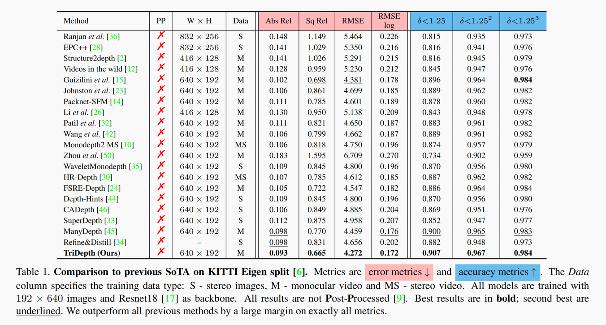
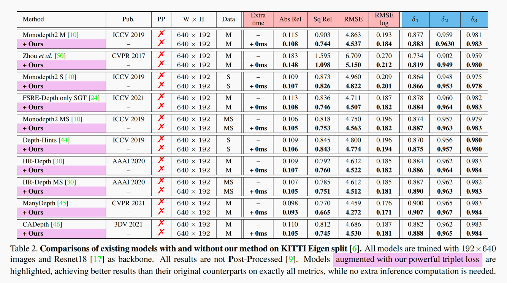

[](https://paperswithcode.com/sota/unsupervised-monocular-depth-estimation-on-4?p=self-supervised-monocular-depth-estimation-3)

# TriDepth

The official Pytorch implementation of the paper "[Self-Supervised Monocular Depth Estimation: Solving the Edge-Fattening Problem](https://arxiv.org/abs/2210.00411)" (**WACV 2023**)

We introduce **TriDepth**, a high-performance depth estimator with a highly generalizable redesigned triplet loss.

## 📈 KITTI Results

#### State-of-the-Art Performance:


#### Also Highly Generalizable:


## ✏️ Citation

If you find our work useful or interesting, please consider citing [our paper](https://arxiv.org/abs/2210.00411).


## 👀 Training

Our code is build upon [Manydepth](https://github.com/nianticlabs/manydepth).

[KITTI-RAW](https://www.cvlibs.net/datasets/kitti/raw_data.php) dataset and pre-computed [segmentation images](https://drive.google.com/file/d/1FNxJzGTfP1O_pUX9Va7d0dqZWtRi833X/view) provided by [FSRE-Depth](https://github.com/hyBlue/FSRE-Depth) are needed for training.

🐷 **Note**: The pre-computed segmentation is **NOT** needed for evaluating.


```
KITTI-RAW/
    ├── 2011_09_26/             
    ├── 2011_09_28/                    
    ├── 2011_09_29/
    ├── 2011_09_30/
    ├── 2011_10_03/
    └── segmentation/   # download and unzip "segmentation.zip" 
```

Training command goes like:
```
python -m manydepth.train --data_path {YOUR_KITTI_DATASET_PATH} --batch_size 8 --model_name {MODEL_NAME_YOU_LIKE}
```


To evaluate, run:
```
python -m manydepth.evaluate_depth --data_path {YOUR_KITTI_DATASET_PATH} --eval_mono --load_weights_folder {YOUR_MODEL_PATH}
```

🐷 **Note**: Make sure you have run `export_gt_depth.py` to generate ground truth depth before evaluating.


## 🌟 Pretrained Model
[Pretrained model (640x192)](https://drive.google.com/file/d/1B75fdPv4lhFQ25Ba7l0gzscPg91mQUZC/view?usp=sharing) is now available!!

